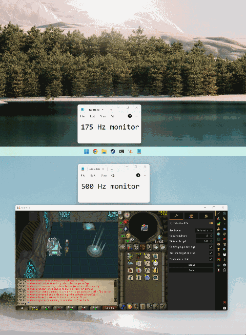

# Adaptive FPS

Keeps RuneLite's FPS target just below the refresh rate of whichever monitor the client window is
currently on.



*Dragging the client between a 500Hz and a 175Hz display. The target follows the window, the change
is announced in game chat, and the plugin panel on the right shows the settings driving it.*

## The problem

On a variable refresh rate display (G-Sync / FreeSync) used with V-Sync, the frame rate has to stay a
few frames *under* the panel's refresh rate. Cross it and the display leaves its VRR window and falls
back to V-Sync, which queues a frame and adds latency — up to a full frame period.

A single fixed FPS target cannot satisfy two monitors with different refresh rates, and the wider
the gap between them the worse it gets. On a 500Hz + 175Hz pair the correct target for the fast
panel is 431, which is 256 frames *over* what the 175Hz panel can display. Drag the client from one
to the other and you silently land on the wrong side of that boundary, with no indication anything
changed.

## What it does

Every two seconds it reads the refresh rate of the monitor the client canvas sits on and sets the
client's FPS target a little below it. Moving the client between monitors re-targets it within a
couple of seconds, with no restart and nothing to configure per monitor.

## How far below the refresh rate

A flat number does not travel across refresh rates. Three frames is 0.85ms of slack at 60Hz but
0.012ms at 500Hz — and frame pacing jitter is an absolute time, not a share of the refresh interval,
so the fast panel ends up with no real margin at all.

The default instead uses `refresh - refresh² / 3600`, which is what NVIDIA's own limiter does: it
reproduces the documented **-1 FPS at 60Hz** and **-16 FPS at 240Hz** exactly. That formula is
equivalent to holding a constant **~0.3ms frametime margin** at every refresh rate, which is the
quantity that actually matters.

| Refresh | Headroom | Target | Frametime margin |
| --- | --- | --- | --- |
| 60Hz | 1 | 59 | 0.28 ms |
| 100Hz | 3 | 97 | 0.31 ms |
| 120Hz | 4 | 116 | 0.29 ms |
| 144Hz | 6 | 138 | 0.30 ms |
| 175Hz | 9 | 166 | 0.31 ms |
| 240Hz | 16 | 224 | 0.30 ms |
| 360Hz | 36 | 324 | 0.31 ms |
| 500Hz | 69 | 431 | 0.32 ms |

Set **Headroom** to `Fixed` if you would rather pick the number yourself.

### Where those numbers come from

Blur Busters' [G-SYNC 101](https://blurbusters.com/gsync/gsync101-input-lag-tests-and-settings/) is
the standard reference for why the cap has to sit below the maximum refresh rate at all: once the
frame rate reaches it, there is nothing left for the variable refresh rate to track, and the display
reverts to V-Sync behaviour or tearing. It recommends a minimum of 3 FPS below refresh, and notes
that a larger margin is wanted as refresh rates climb.

The scaling itself comes from what NVIDIA's own limiter does. In the
[G-SYNC 101 discussion thread](https://forums.blurbusters.com/viewtopic.php?t=3441), jorimt — the
article's author — describes the automatic limit applied by Low Latency Mode Ultra / Reflex as
using **-1 FPS at 60Hz** and **-16 FPS at 240Hz**, scaling with refresh rate to absorb frametime
variance.

Both of those points are reproduced exactly by `refresh² / 3600`:

- 60² / 3600 = **1**
- 240² / 3600 = **16**

which is why this plugin uses that expression rather than a hand-picked curve.

One caveat worth stating plainly: the two published data points are 60Hz and 240Hz, so anything
faster is an **extrapolation**. It is a well-behaved one — the constant ~0.3ms frametime margin
holds across the whole range rather than diverging — but a 500Hz target of 431 is inferred, not
measured. `Fixed` is there for anyone who would rather not rely on that.

## What it changes

The target is applied with `Client.setUnlockedFpsTarget(int)` — the same client API call both
`GpuPlugin.setupSyncMode` and `HdPlugin.setupSyncMode` make. That is a runtime value, not a stored
setting, so:

- **Your renderer's own "FPS target" setting is never written.** It keeps whatever you set it to,
  and it is what takes effect again the moment this plugin is disabled or the client is restarted.
- **Nothing needs restoring**, because nothing was persisted. There is no state left behind on disk
  if you uninstall the plugin.
- Rather than adding a second, competing frame limiter, this drives the one the client already has.

The one exception is the optional **Fix vsync and Unlock FPS** checkbox, which is off by default.
Only when you turn it on does the plugin write to your renderer's configuration, and only these two
keys, in whichever group is active:

| Key | Set to | Restored when |
| --- | --- | --- |
| `gpu.vsyncMode` / `hd.vsyncMode` | `OFF` | you switch the checkbox off, or disable Adaptive FPS |
| `gpu.unlockFps` / `hd.unlockFps` | `true` | you switch the checkbox off, or disable Adaptive FPS |

Turning the checkbox on raises RuneLite's built-in confirmation dialog first, every change is
announced in chat, and only values the plugin itself overwrote are ever put back. A key you had
never set is cleared again rather than written back with a value you never chose.

## Supported renderers

Both the core **GPU** plugin and **117 HD** are supported, and whichever is enabled is detected
automatically — there is nothing to select. RuneLite treats the two as mutually exclusive (117 HD
declares `conflicts = "GPU"`), so exactly one of them is ever running.

They are driven identically because they behave identically: both use the config keys `fpsTarget`,
`unlockFps` and `vsyncMode`, both end `setupSyncMode` with
`setUnlockedFpsTarget(swapInterval == 0 ? fpsTarget : 0)`, and both re-run that method when any of
those three keys changes.

## Requirements

Whichever renderer you use must have:

- **Unlock FPS** on — otherwise the client is capped at 50 FPS and the target is irrelevant.
- **Vsync mode: Off** — both renderers pass `0` to `setUnlockedFpsTarget` whenever the swap interval
  is non-zero, so any target is discarded when vsync is on or adaptive.

**117 HD users should expect to change both.** Its defaults are `Unlock FPS` **off** and
`Vsync Mode: Adaptive`, so a stock 117 HD install fails both conditions and the plugin will say so
in chat on first run. The core GPU plugin defaults to `Unlock FPS` on and `Vsync mode: Off`, so a
stock install there already satisfies them.

The plugin detects both conditions and says so in chat rather than failing silently.

Note that `Vsync mode: On` is itself partly monitor-adaptive — it locks presentation to the current
display's refresh. It is not a substitute here, because it locks *at* the refresh rate rather than
below it, which is the wrong side of the VRR boundary.

## Verified behaviour

Three assumptions were checked empirically on a 500Hz + 175Hz pair rather than assumed:

1. **Java reports both refresh rates correctly.** `GraphicsDevice.getDisplayMode().getRefreshRate()`
   returns 500 and 175. The 175Hz panel is actually 174.963Hz; Java rounds it to 175, which is the
   number we want.
2. **AWT updates the canvas `GraphicsConfiguration` when the window moves.** A canvas in a frame moved
   between monitors reports the new device and its refresh rate — it does not cache the original.
3. **The target applies live.** `Client.setUnlockedFpsTarget` is the same call both
   `GpuPlugin.setupSyncMode` and `HdPlugin.setupSyncMode` make, confirmed by reading each upstream —
   117 HD against release 1.5.2 and the commit the Plugin Hub pins. Both re-assert their own value
   whenever one of their sync settings changes, so the target is re-applied on every poll rather
   than only when it changes. Catching the config event merely makes that happen sooner: which
   plugin's event handler runs first is not defined, so correctness cannot depend on winning it.

Displays that report `REFRESH_RATE_UNKNOWN` (some drivers, virtual displays, remote sessions) are
left alone rather than guessed at.

## Status

Proof of concept, exercised against a real client on a 500Hz + 175Hz pair:

```
Adaptive FPS started
Display \Display1 at 500Hz -> FPS target 431
Display \Display0 at 175Hz -> FPS target 166     (client dragged to the 175Hz panel)
Display \Display1 at 500Hz -> FPS target 431     (dragged back)
```

Retargeting works in both directions within one poll interval, with no exceptions raised.

Known limitations:

- Inert while the active renderer's vsync mode is anything but Off, because both discard any target
  when syncing to the display. The plugin reports this in chat rather than failing silently, but it
  cannot fix it for you unless you ask it to.
- Your renderer's "FPS target" setting keeps showing your configured number rather than the one
  actually in effect. That is the deliberate trade for never writing to it; the active target is
  reported in chat and in the log instead.
- 117 HD's settings are read by key name and its defaults are transcribed rather than inherited,
  since it is a Hub plugin and cannot be compiled against. If it ever renames one of those keys the
  cost is a spurious warning, not a wrong frame cap.

Nothing in the RuneLite Plugin Hub does this today — all 2209 plugin manifests were checked. The
natural long-term home for this is the core GPU plugin itself, which already owns both `fpsTarget`
and `vsyncMode`; a config option there ("target current display refresh minus N") would cover every
user without a second plugin. This repository exists to prove the approach before proposing that
upstream.

## Configuration

| Setting | Default | Purpose |
| --- | --- | --- |
| Headroom | Automatic | How far below the refresh rate to cap. Automatic suits any panel; Fixed uses the number below |
| Fixed headroom | 3 | Frames below the refresh rate. Ignored unless Headroom is Fixed |
| Minimum target | 30 | Never cap below this, whatever the display reports |
| Fix vsync and Unlock FPS | off | Turns the active renderer's vsync off and Unlock FPS on, which the target needs to work. Asks first, and switching it back off restores them |
| Announce in chat | on | Chat message when the target changes |

## Building

```
./gradlew build
```
